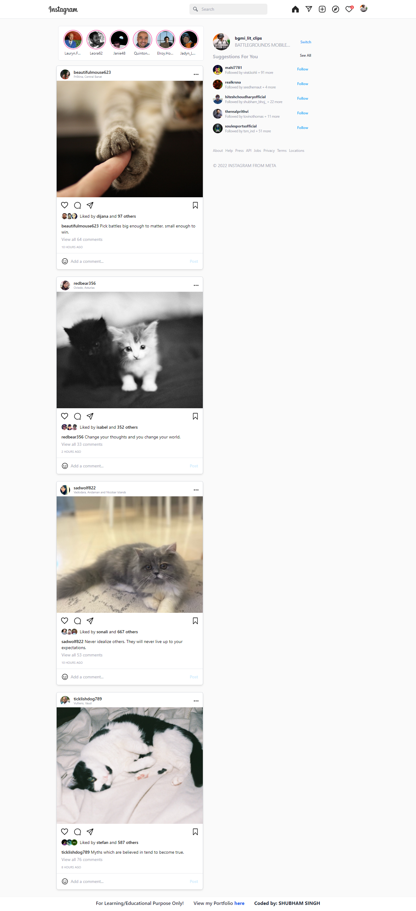
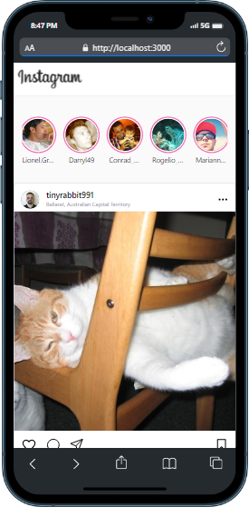
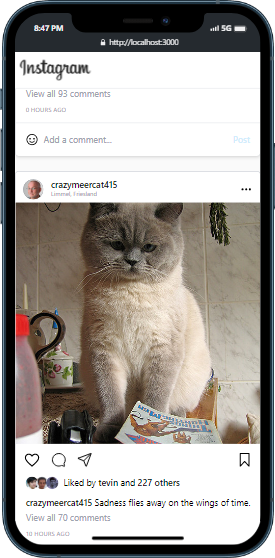

# Instagram Clone

## Description

A [**Catgram**]() is an instagram clone(Front-end as of now) where user can see multiple cats images and videos(as gifs) fetching from the [Cat API]() with random users.

## Links for Project

- ### 📌 [LIVE Project Link](https://instagram-fsjs.netlify.app/)

- ### 📌 [YouTube Link](https://youtu.be/nho0m2YAEbc)

## Project Status

This project `version 2` is currently in development. Users can view posts & interact with them. Functionality to Login and Signup and dark mode is in progress.

## Tech Stack Used

## APIs Used:

- [Cats API](https://api.thecatapi.com/)

- [Random User API](https://randomuser.me/api/)

- [Quotable API](https://api.quotable.io/)

## Installation and Setup Instructions

1. Clone down this repository. You will need `node` and `npm` installed globally on your machine.

2. Installation: `npm install`

3. To Start Server: `npm start`

4. To Visit App: `localhost:3000/`

## Project Screen Shot(s)

## Checkout Portfolio & Other Projects

### ⭐ [Personal Portfolio](https://shubhambhoj.in)

## Connect with Me

- [Mailto](mailto:shubhambhoj3@gmail.com)

- [LinkedIn](https://www.linkedin.com/in/shubham-singh-b122b7171/)

---

[GO TO TOP](#instagram-clone)
